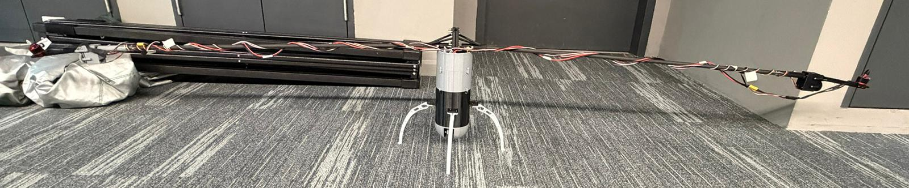
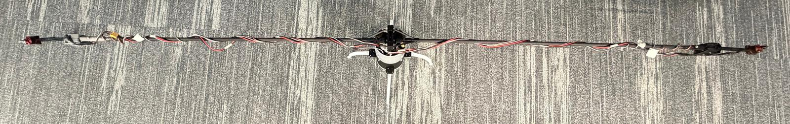
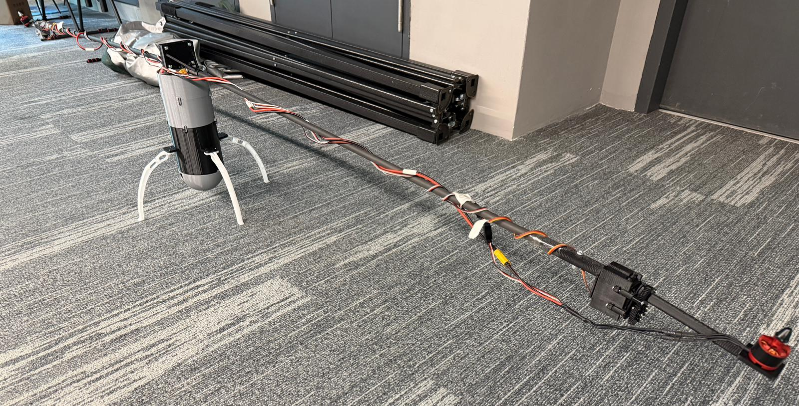
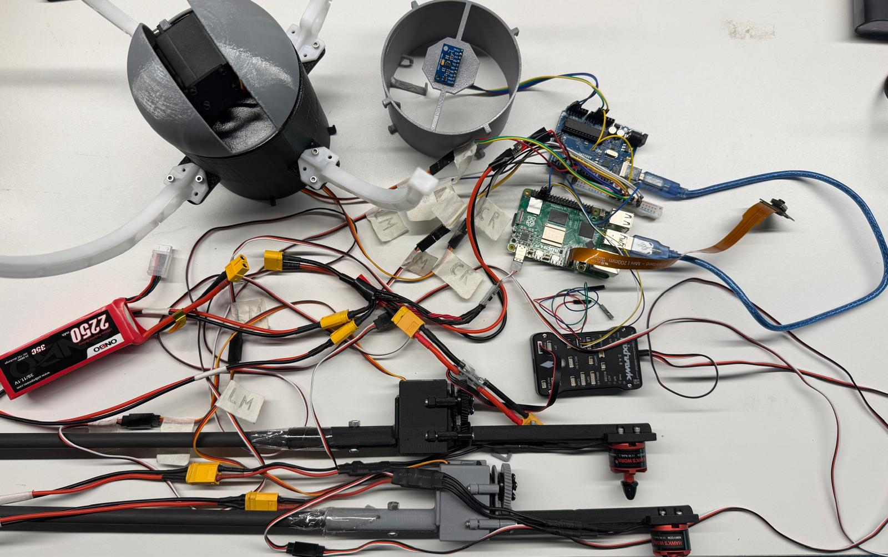

# Helium-drone_hybrid_project

An internship project to develop a working prototype of a helium drone hybrid

---

## Project Overview

This project focuses on developing a hybrid aerial system designed for **sustained surveillance**. By combining the natural lift of a helium balloon with the controlled movement of a drone, the system aims to remain airborne for extended periods while still being able to navigate its environment.

The helium component provides passive lift, reducing the energy required to stay airborne and enabling longer operation compared to traditional drones. Motorized propulsion allows the system to reposition and maintain control when needed, while an onboard camera supports real-time observation.

This project primarily serves as an **experimental prototype** to evaluate the feasibility and effectiveness of such a hybrid system. It explores how well a helium-assisted platform can perform in practical scenarios, identifying both its advantages and limitations.

Overall, the work lays the groundwork for future improvements in long-duration aerial monitoring, system stability, and autonomous capabilities.

---

## System Architecture

The system is built around a distributed architecture where each component is responsible for a specific function:

* **Raspberry Pi 5** – Main processing unit, handles high-level control, ROS 2 communication, and future vision processing
* **Arduino Uno** – Controls servos and processes IMU data
* **Pixhawk 2.4.8** – Handles motor control and low-level flight stabilization

This separation allows the system to remain modular, making it easier to debug, upgrade, and expand in future iterations.

---

## Hardware

### Mechanical Structure

The parts within this folder correspond to the **final tested prototype** used during system validation. This includes the full mechanical structure that supports the propulsion system, electronics, and camera assembly.

While this design was functional, it should be considered an **early iteration**. A redesign is recommended to improve:

* Wiring integration and routing
* Structural strength and weight distribution
* Ease of assembly and maintenance
* Mounting solutions for electronics and sensors

### Full Assembly

---

### Electronics

#### Components Used

**Control Systems**

* Raspberry Pi 5
* Arduino Uno
* Pixhawk 2.4.8

**Actuation**

* MG996R Servos
* A2212 Brushless Motors
* Electronic Speed Controllers (ESCs)

**Sensing**

* MPU9250 IMU

**Wiring and Power**

* Jumper wires (male-to-male, male-to-female)
* Servo extension cables
* Custom XT60 power cables (~1m)
* Custom power distribution wiring
* Additional connection wires

#### Wiring Layout

#### Design Considerations

* Avoid powering servos directly from microcontroller 5V rails
* Improve cable management and routing
* Replace temporary jumper wires with secure connectors
* Use dedicated power distribution solutions
* Integrate wiring paths into the mechanical design

---

## Software

The system software is primarily built on **ROS 2**, enabling communication between different components of the system.

### Key Features

* Serial communication between Raspberry Pi and Arduino for servo control and IMU data
* MAVLink communication between Raspberry Pi and Pixhawk for motor control
* Teleoperation nodes for movement and camera control
* Real-time sensor feedback integration

The software is designed to be modular, allowing future integration of computer vision and autonomous control systems.

---

## Results and Testing

The prototype successfully demonstrated:

* Basic controlled movement using motor tilt mechanisms
* Stable communication between Raspberry Pi, Arduino, and Pixhawk
* Real-time IMU data acquisition
* Functional camera positioning system

The system validated the core concept of combining helium lift with drone propulsion for extended operation.

---

## Limitations

* Limited stability in dynamic environments
* No true position hold (IMU-only stabilization)
* Wiring complexity affects reliability
* Mechanical structure not optimized for long-term use

---

## Future Work

Future improvements will focus on:

* Improved mechanical design with integrated wiring channels
* Advanced stabilization algorithms
* Integration of additional sensors (e.g. GPS, barometer)
* Computer vision for tracking and autonomous navigation
* More efficient power distribution system

---

## Acknowledgements

This project was developed as part of an internship program, serving as a proof-of-concept for hybrid aerial surveillance systems.
